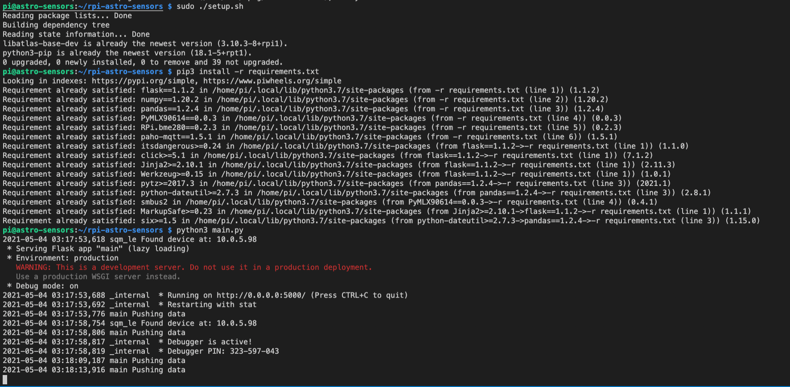
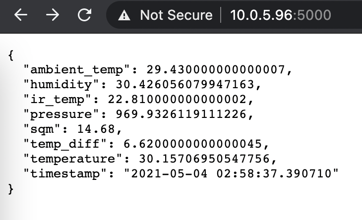

# Raspberry Pi Sensors for Astronomy

The goal of this project is to serve sensor data using a raspberry pi that include sensors:
- [BME280](https://www.adafruit.com/product/2652) - including data for Humidity, Temperature, Barometric Pressus
- [IMX90614](https://www.sparkfun.com/products/9570) - non-contact infrared thermometer, used to determine the temperature of the sky to detect the presence of clouds.  As the sky becomes more clear, the sky temperature is much colder.  Comparing the IR temperature with the ambient temperature gives an indication of cloud cover.
- [SQM-LE](http://unihedron.com/projects/sqm-le/), or a [Home-built SQM-LE](https://github.com/gshau/SQM_TSL2591) - used to measure the sky brightness in units of magnitudes per square arcseconds.

These data can be pushed to a mosquitto MQTT broker, or served via a rest api.

## Installation

On a clean raspberry pi lite install, run the setup script.  It installs python, and python libraries, registers the service and enables it on reboots
```
pi@astro-sensors:~/rpi-astro-sensors $ ./setup.sh
```

## Usage

Edit the `main.py` file to point to your MQTT broker.  
Run the service with 
```
pi@astro-sensors:~/rpi-astro-sensors $ systemctl start astro-sensor.service
```
Stop the service with 
```
pi@astro-sensors:~/rpi-astro-sensors $ systemctl stop astro-sensor.service
```
Restart the service with 
```
pi@astro-sensors:~/rpi-astro-sensors $ systemctl restart astro-sensor.service
```

### Example Usage
#### Install / Run


#### API Response

